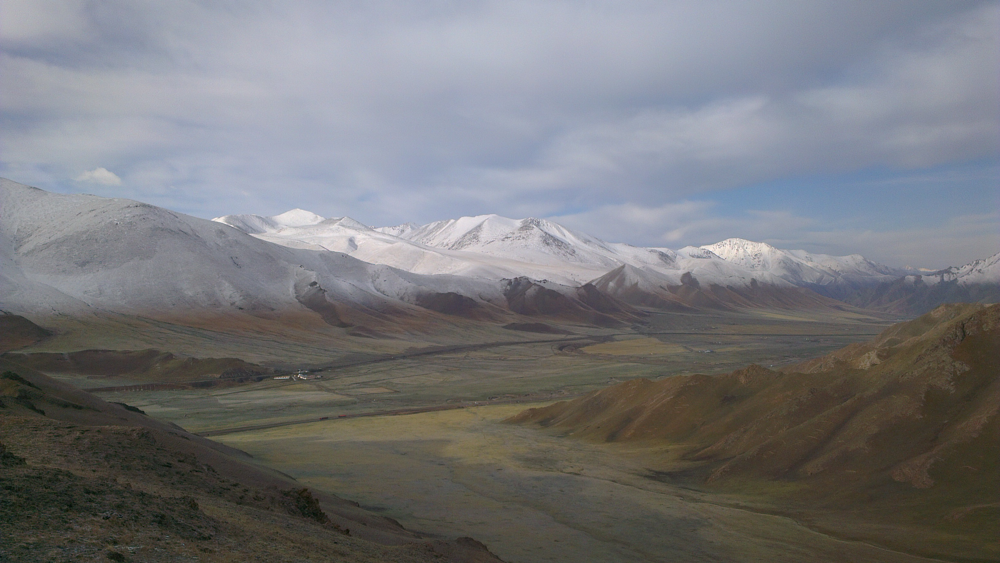

# The GRAND project

__GRAND__ (**G**iant **R**adio **A**rray for **N**eutrino **D**etection) is a
proposal for an array of ~200'000 radio antennas to be deployed over an area of
200'000 km².  GRAND will be a multi-messenger instrument for the detection of
ultra-high-energy astrophysical neutrinos and cosmic rays.  Its envisioned
science program also includes searches for UHE photons and radio sources such
as fast radio bursts. See this [proceeding][1] for more details.

_View of the Ulastai Valley, home of the 21CMA & GRANDproto set-ups._

[1]: https://www.epj-conferences.org/articles/epjconf/pdf/2017/04/epjconf_arena2017_02001.pdf
